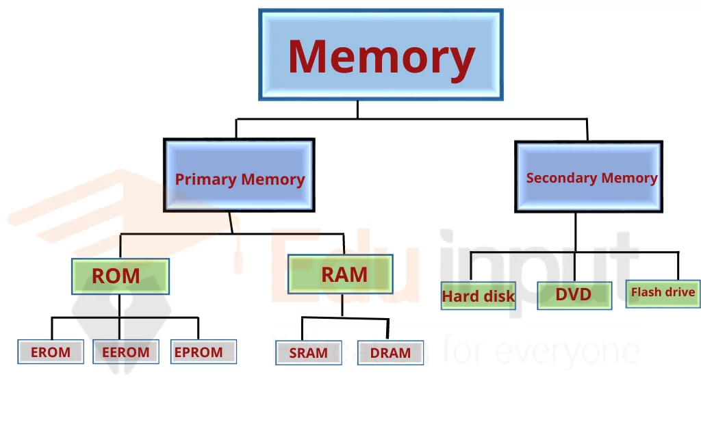
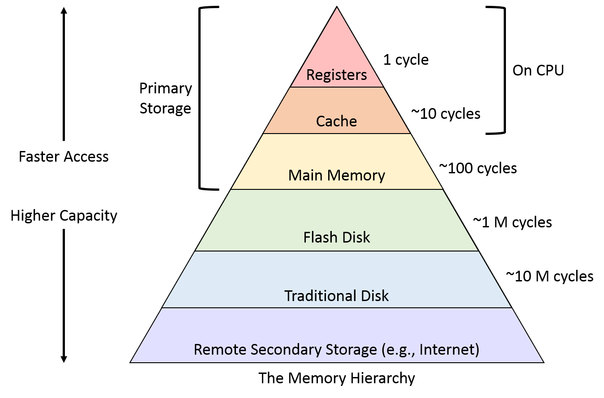

### Unit 2: Memory Organization

Memory organization in computer systems refers to how memory is structured and how different memory types interact with the CPU. This organization impacts performance, efficiency, and how quickly the system can process data.

---

#### **2.1 Memory Hierarchy**
Memory hierarchy refers to the arrangement of different types of memory in a computer system based on their speed, cost, and size. The hierarchy is designed to ensure that the most frequently accessed data is stored in the fastest memory locations, minimizing latency.

- **Levels of Memory Hierarchy**:
  1. **Registers** (fastest, but very limited in size)
  2. **Cache Memory** (L1, L2, L3 caches)
  3. **Main Memory (RAM)**
  4. **Secondary Storage** (Hard drives, SSDs)
  5. **Tertiary Storage** (Optical disks, tapes)
 
     

The memory hierarchy optimizes cost and performance by providing faster but more expensive memory at the top and slower, larger capacity storage at the bottom.

---

#### **2.2 RAM and ROM Chips, Memory Address Map, Memory Connections to CPU**
- **RAM (Random Access Memory)**: 
  - Volatile memory used to store data and instructions that are actively being processed.
  - **Types of RAM**:
    - **DRAM (Dynamic RAM)**: Needs periodic refreshing.
    - **SRAM (Static RAM)**: Faster and does not need refreshing, but more expensive.

- **ROM (Read-Only Memory)**:
  - Non-volatile memory used to store firmware and critical system instructions.
  - **Types of ROM**:
    - **PROM (Programmable ROM)**: Can be written once.
    - **EPROM (Erasable Programmable ROM)**: Can be erased and rewritten.
    - **EEPROM (Electrically Erasable Programmable ROM)**: Can be electrically erased and rewritten.

- **Memory Address Map**:
  - Defines the range of memory addresses for each type of memory (e.g., RAM, ROM, I/O ports). The CPU accesses these addresses to read from or write to the memory.

- **Memory Connections to CPU**:
  - The CPU communicates with memory through buses (address bus, data bus) and controllers. The address bus identifies the memory location, while the data bus carries the data being read from or written to that location.

---

#### **2.3 Auxiliary Memory: Magnetic Disks and Magnetic Tapes**
- **Magnetic Disks**: 
  - Used for secondary storage. Examples include hard drives (HDDs) and solid-state drives (SSDs).
  - **Hard Disks**: Rotating platters coated with magnetic material. Data is read/written using a magnetic head.
  - **SSD**: Uses flash memory chips to store data, offering faster access speeds than HDDs.

- **Magnetic Tapes**:
  - Used for archival storage due to its high storage capacity and lower cost.
  - Data is stored sequentially, making it slower for random access but useful for backups and long-term storage.

---

#### **2.4 Associative Memory**
- **Associative Memory (Content Addressable Memory - CAM)**:
  - Memory where data can be accessed based on its content rather than a specific memory address.
  - The data is compared in parallel, making search operations faster. Used in applications like network routing and searching algorithms.

---

#### **2.5 Cache Memory**
- **Cache Memory**:
  - A small, fast type of volatile memory used to temporarily store frequently accessed data and instructions.
  - **Levels of Cache**:
    - **L1 Cache**: Closest to the CPU cores and fastest.
    - **L2 Cache**: Larger but slightly slower than L1.
    - **L3 Cache**: Shared among CPU cores, larger and slower than L2.
  - Cache helps improve processing speed by reducing the time it takes to fetch data from slower main memory.

---

#### **2.6 Virtual Memory**
- **Virtual Memory**:
  - Allows the system to compensate for physical memory shortages by using a portion of the hard drive (or SSD) as an extension of RAM.
  - It creates an illusion of a larger pool of memory by swapping data between the RAM and the storage.
  - Virtual memory is managed by the operating system through the concept of **paging** or **segmentation**.

---

#### **2.7 Memory Management Hardware**
- **Memory Management Unit (MMU)**:
  - A hardware component responsible for handling memory management tasks, such as address translation (virtual to physical addresses), and memory protection.
  - The MMU ensures that programs do not interfere with each other's memory and handles the virtual memory system.

---

#### **2.8 Read and Write Operations**
- **Read Operation**:
  - Involves retrieving data from memory.
  - The CPU provides the memory address, and the memory unit sends back the data stored at that address.

- **Write Operation**:
  - Involves saving data to memory.
  - The CPU provides both the memory address and the data, which is then stored at the specified location.

Both operations involve using buses to transfer data between the CPU and memory.

---

### Summary
Memory organization is essential in computer systems for effective data storage and retrieval. The memory hierarchy optimizes performance by using a combination of fast, small memories (like cache) and larger, slower storage (like magnetic disks). Various memory types, such as RAM, ROM, and associative memory, serve different purposes, with cache and virtual memory playing crucial roles in improving system efficiency. Memory management hardware, including the MMU, helps to manage and protect memory usage, ensuring smooth operation across different types of memory in the system.
