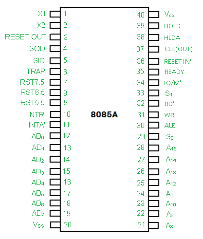

### **Unit 5: 8085 Microprocessor**

The **8085 microprocessor** is a widely used **8-bit microprocessor** developed by **Intel** in the mid-1970s. It is a crucial part of the evolution of microprocessor technology and serves as a fundamental component for various computing applications. This unit covers the **introduction**, **architecture**, **pin diagram**, and **comparison with 8086** microprocessor.

---

#### **5.1 Introduction to 8085 Microprocessor**

The **Intel 8085** is an 8-bit **microprocessor** that was developed to support embedded systems and small computing devices. It is a successor of the **8080 microprocessor** and was designed to be **more efficient**, offering a higher clock speed and lower power consumption. The **8085** is used in many simple applications such as **microcontrollers**, **embedded systems**, and **industrial control systems**.

- **Word Size:** 8-bit
- **Data Bus:** 8-bit
- **Address Bus:** 16-bit (64KB memory addressing)
- **Clock Speed:** 3 MHz, 5 MHz, 8 MHz
- **Instruction Set:** Simple and efficient
- **Power Supply:** 5V
- **Package:** 40-pin Dual Inline Package (DIP)

---

#### **5.2 Architecture of 8085 Microprocessor**

The architecture of the **8085 microprocessor** consists of the following primary components:

1. **Arithmetic and Logic Unit (ALU)**:
   - Performs arithmetic operations (addition, subtraction) and logical operations (AND, OR, XOR).
   
2. **Accumulator**:
   - An 8-bit register used to store intermediate results of ALU operations.

3. **Registers**:
   - There are **6 general-purpose 8-bit registers** (B, C, D, E, H, L) for temporary storage of data during execution.
   - **Stack Pointer (SP)**: Points to the top of the stack in memory.
   - **Program Counter (PC)**: Keeps track of the next instruction to be executed.

4. **Control Unit (CU)**:
   - The control unit generates control signals required for the proper execution of instructions.
   
5. **Timing and Control Circuit**:
   - Provides the necessary control signals for data transfer between the microprocessor and memory or I/O devices.

6. **Instruction Decoder**:
   - Decodes the opcodes of instructions and determines the operation to be performed by the microprocessor.

7. **Interrupt Control**:
   - Manages external interrupts to the microprocessor, enabling it to respond to requests from peripheral devices.

8. **Memory Interface**:
   - Supports communication with memory (RAM, ROM) using the **address bus** and **data bus**.

---

#### **5.3 Pin Diagram of 8085 Microprocessor**

The **8085 microprocessor** has **40 pins**, which are divided into different categories:

- **Power Supply Pins:**
  - **Vcc (Pin 40)**: Power supply (5V).
  - **GND (Pin 20)**: Ground.

- **Address Bus:**
  - **A15 - A8 (Pins 1 - 8)**: High-order address bus (16-bit address bus).

- **Data Bus:**
  - **AD7 - AD0 (Pins 12 - 19)**: 8-bit multiplexed data bus (used for both data and low-order address).

- **Control Pins:**
  - **ALE (Pin 9)**: Address Latch Enable, used to separate address and data on the multiplexed bus.
  - **IO/M (Pin 26)**: Indicates whether the operation is related to I/O or memory.
  - **RD (Pin 32)**: Read control signal for memory or I/O read operations.
  - **WR (Pin 31)**: Write control signal for memory or I/O write operations.
  
- **Interrupt Pins:**
  - **INTR (Pin 6)**: Interrupt request.
  - **INTA (Pin 5)**: Interrupt acknowledge.
  
- **Clock Pin:**
  - **CLK (Pin 37)**: Provides the clock signal to synchronize operations.

- **Serial Data Pins:**
  - **SID (Pin 35)**: Serial input data.
  - **SOD (Pin 36)**: Serial output data.

- **Reset Pins:**
  - **RESET IN (Pin 21)**: Resets the microprocessor.
  - **RESET OUT (Pin 22)**: Indicates that the processor is in reset state.

---

#### **5.4 Comparison between 8085 and 8086 Microprocessors**

| Feature                   | **8085 Microprocessor**                             | **8086 Microprocessor**                             |
|---------------------------|-----------------------------------------------------|-----------------------------------------------------|
| **Data Bus**               | 8-bit                                              | 16-bit                                              |
| **Address Bus**            | 16-bit (64KB addressing)                           | 20-bit (1MB addressing)                            |
| **Word Size**              | 8-bit                                              | 16-bit                                              |
| **Clock Speed**            | Up to 8 MHz                                        | 5 MHz to 10 MHz                                     |
| **Instruction Set**        | Simple, less complex                               | More complex, supports advanced operations          |
| **Architecture**           | Single bus architecture (Von Neumann architecture) | Dual bus architecture (Harvard architecture)       |
| **Registers**              | 6 general-purpose 8-bit registers                  | 8 general-purpose 16-bit registers                  |
| **Memory**                 | 64KB max (16-bit addressing)                       | 1MB max (20-bit addressing)                        |
| **Interrupt Handling**     | 5 interrupt lines                                  | 256 interrupt lines                                |
| **Multiplexed Address/Data**| Yes (for lower address lines)                      | No, separate address and data buses                |
| **Power Consumption**      | Low power consumption                              | Higher power consumption                           |

---

