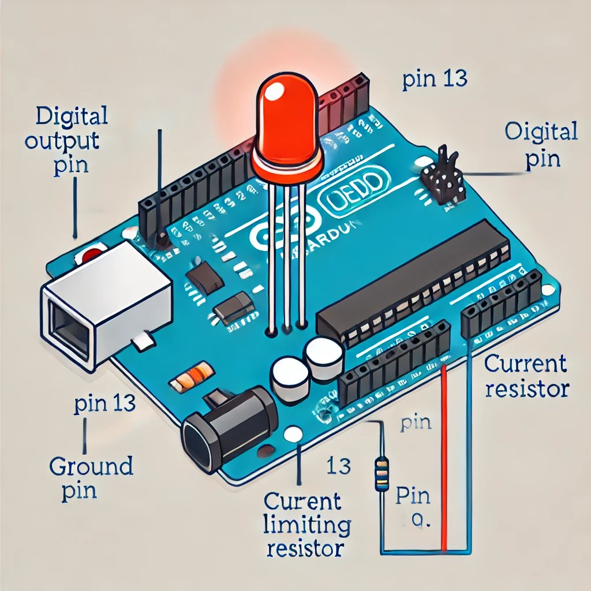

## **Practical 1: Installation of Arduino IDE**

---

#### **Aim**
The aim of this practical is to demonstrate the steps involved in installing the **Arduino Integrated Development Environment (IDE)**, which is used for writing and uploading code to Arduino boards.

#### **Introduction**
The **Arduino IDE** is a cross-platform application used to write and upload programs (known as sketches) to an Arduino board. It supports various programming languages like **C** and **C++**, making it easy to interface with different sensors, actuators, and other hardware.

---

### **Steps to Install Arduino IDE**

#### **Step 1: Download the Arduino IDE**
1. **Go to the Official Arduino Website**:
   - Open a web browser and visit the official Arduino website: [https://www.arduino.cc/](https://www.arduino.cc/).
  
2. **Navigate to the Download Section**:
   - On the Arduino homepage, click on the **"Software"** tab located in the top menu.
   - In the dropdown menu, select **"Download the Arduino IDE"**.

3. **Select Your Operating System**:
   - The website will show download options for different operating systems:
     - **Windows**
     - **Mac OS**
     - **Linux**
   - Choose the appropriate version based on your operating system.

#### **Step 2: Install Arduino IDE on Windows**
1. **Download the Windows Installer**:
   - Click on the **Windows** option to download the executable file.
  
2. **Run the Installer**:
   - Once the file is downloaded, locate the installer file (typically `arduino-x.x.x-windows.exe`).
   - Double-click to launch the installation process.

3. **Follow the Installation Wizard**:
   - Accept the License Agreement.
   - Choose the installation folder or leave it as default.
   - Choose whether to install additional drivers (USB drivers for Arduino boards).
   - Click **"Install"** to proceed.
   - Once the installation is complete, click **"Close"**.

4. **Launch the Arduino IDE**:
   - After installation, locate the **Arduino IDE** from the **Start menu** or the desktop shortcut and launch it.

#### **Step 3: Install Arduino IDE on macOS**
1. **Download the macOS Installer**:
   - Select the **Mac OS** version of the Arduino IDE and download the `.dmg` file.

2. **Install the Arduino IDE**:
   - Open the `.dmg` file and drag the **Arduino** application into the **Applications** folder.

3. **Launch the Arduino IDE**:
   - Go to the **Applications** folder, find the **Arduino IDE**, and double-click to open it.

#### **Step 4: Install Arduino IDE on Linux**
1. **Download the Linux Version**:
   - Select the **Linux** option for your distribution (32-bit or 64-bit).
   - Download the compressed `.tar.xz` file.

2. **Extract and Install**:
   - Extract the contents of the `.tar.xz` file.
   - Open a terminal and navigate to the extracted folder.
   - Run the `install.sh` script to install the Arduino IDE.

3. **Launch the Arduino IDE**:
   - Once installed, you can launch the Arduino IDE from the terminal or through your system’s application menu.

---

### **Step 5: Setup the Arduino IDE**
1. **Select Your Arduino Board**:
   - Connect your Arduino board (such as **Arduino Uno**) to your computer via USB.
   - Open the Arduino IDE.
   - Go to **Tools > Board** and select the appropriate board type (e.g., **Arduino Uno**).

2. **Select the Serial Port**:
   - Go to **Tools > Port** and select the port to which your Arduino is connected (e.g., COM3 on Windows or `/dev/ttyUSB0` on Linux).

3. **Install Drivers (if necessary)**:
   - If you are using Windows, make sure the necessary drivers for your Arduino board are installed. These drivers are typically included in the IDE installation, but in some cases, you might need to manually install them.

---

### **Step 6: Verify the Installation**
1. **Test the Installation**:
   - To verify that everything is set up correctly, open the **"Blink"** example from the Arduino IDE:
     - Go to **File > Examples > 01.Basics > Blink**.
     - This program makes the built-in LED on the Arduino board blink on and off.
   
2. **Upload the Sketch**:
   - Click on the **Upload** button (the right arrow icon) in the IDE. The sketch will compile and upload to the Arduino board.
   - If successful, the LED on the board will start blinking, confirming that the installation was successful.

---


<br>
<br>
<br>
<br>
<br>
<br>
<br>
<br>


## **Practical 2: Interfacing Light Emitting Diode (LED) - Blinking LED**

---

#### **Aim**
To interface an **LED (Light Emitting Diode)** with an **Arduino** board and blink the LED using a simple code.

#### **Introduction**
An **LED** is a semiconductor device that emits light when current flows through it in the forward direction. It is often used as an indicator in various electronic projects. In this practical, we will interface an LED with an Arduino board and write a simple program to make it blink. The blinking of the LED will be achieved by turning it ON and OFF at regular intervals.

---

### **Required Components**
1. **Arduino Board** (e.g., Arduino Uno)
2. **LED** (Light Emitting Diode)
3. **Resistor** (220 ohms)
4. **Breadboard** (Optional)
5. **Jumper Wires**

---

### **Circuit Diagram**

Below is the circuit diagram that demonstrates how to interface an LED with an Arduino. The LED is connected to **Pin 13** (digital output pin) of the Arduino board, with a current-limiting resistor (220 ohms) in series to prevent the LED from burning out due to excess current. The negative terminal of the LED is connected to the **ground (GND)** pin of the Arduino.

---

### **Steps for Interfacing LED with Arduino**
1. **Connect the Components**:
   - Connect the **anode (longer leg)** of the LED to **Pin 13** on the Arduino board.
   - Connect the **cathode (shorter leg)** of the LED to **GND** (ground) on the Arduino board.
   - Place a **220-ohm resistor** between Pin 13 and the anode of the LED to limit the current flowing through the LED.

2. **Write the Code**:
   Open the **Arduino IDE** and write the following code to make the LED blink.

---

### **Arduino Code:**

```cpp
void setup() {
  pinMode(13, OUTPUT);  // Set Pin 13 as output
}

void loop() {
  digitalWrite(13, HIGH);  // Turn LED on
  delay(1000);              // Wait for 1 second
  digitalWrite(13, LOW);   // Turn LED off
  delay(1000);              // Wait for 1 second
}
```

#### **Explanation of the Code**:
1. **`pinMode(13, OUTPUT);`**: This line sets **Pin 13** as an output pin, which is where the LED is connected.
2. **`digitalWrite(13, HIGH);`**: This turns the LED on by supplying **5V** to Pin 13.
3. **`delay(1000);`**: This introduces a delay of **1000 milliseconds (1 second)**, keeping the LED on for 1 second.
4. **`digitalWrite(13, LOW);`**: This turns the LED off by setting Pin 13 to **LOW**, i.e., 0V.
5. **`delay(1000);`**: Another 1-second delay, keeping the LED off for 1 second.

---

### **Upload and Test the Program**
1. Connect your Arduino board to your computer via a **USB cable**.
2. Open the **Arduino IDE**, paste the code, and click on the **Upload** button (the arrow icon).
3. After the code is successfully uploaded, the LED connected to Pin 13 should start blinking, turning ON for 1 second and OFF for 1 second repeatedly.




